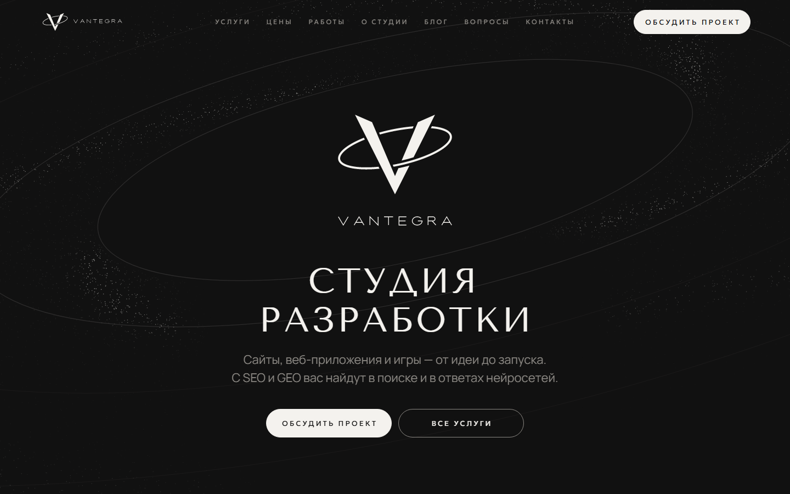

# Vantegra — сайт студии разработки

Новый сайт студии Vantegra для домена vantegracode.ru: тёмный, в стиле брендбука «сажа и мел», с вращающимся 3D-знаком и пылевым диском эхо-орбит на первом экране.

**Превью:** https://kidw3st.github.io/vantegracode.v2/ — закрыто от поисковиков, форма заявки в нём только имитирует отправку.



## Статус

Сайт в работе. Готовы: дизайн-система и служебная страница `/styleguide/`, главная, шапка, подвал, мобильное меню. Дальше — страницы услуг, цен, работ, «О студии», блог, вопросы, контакты, политика, форма на PHP, SEO и проверки. Подробности — в [PLAN.md](PLAN.md), незаполненные данные (цены, условия, реквизиты) — в [TODO.md](TODO.md).

## Что внутри

- **Astro 7** (статическая сборка), TypeScript strict, обычный CSS, ванильный TS — без фреймворков и UI-библиотек.
- **Дизайн-токены** — `src/styles/tokens.css`; тексты и цены — в `src/data/` и `src/content/`, на страницах не захардкожены.
- **Эхо-орбиты** — эллипсы −12° с отношением осей 0,306; внутренняя орбита рассчитывается так, чтобы не задевать логотип с охранным полем (`src/lib/orbit.ts`).
- **3D-знак** — модель из Blender (`tools/hero-mark.py`) по контурам логотипа, рисуется в реальном времени на WebGL (`src/scripts/hero.ts`).
- **Пылевой диск** — частицы на кеплеровских орбитах, WebGL (`src/scripts/disc.ts`).
- **Шапка** — наверху плоская, при прокрутке перетекает в капсулу (`src/scripts/header.ts`).
- **Иконки** — собственный пак из 64 SVG в стиле бренда (`src/assets/icons/`, компонент `src/components/Icon.astro`), проверка — `npm run icons:check`, лист превью — `npm run icons:sheet`.

## Запуск

Нужен Node.js 22.12 или новее.

```bash
npm install
npm run dev
```

Сборка — `npm run build` (результат в `dist/`), проверка типов — `npm run check`, скриншоты — `npm run shots`.

Превью для GitHub Pages собирается командой `node tools/pages-build.mjs` и публикуется автоматически при пуше в `main` (`.github/workflows/pages.yml`).

## Структура

```text
src/
  data/          контакты, условия, тексты страниц
  content/       услуги, цены, вопросы, блог
  components/    компоненты интерфейса
  layouts/       общий каркас страниц
  pages/         страницы сайта
  scripts/       клиентские скрипты
  styles/        токены и базовые стили
  lib/           типограф, подстановка значений, геометрия орбит, SEO
public/          шрифты, иконки, модель знака
tools/           рендер знака в Blender, сборка превью
tests/           скриншоты и проверки
docs/            скриншоты и документы
```

Материалы бренда (исходники логотипа, шрифты, брендбук) в репозиторий не входят — на сайте используются только их копии из `public/` и `src/assets/`.

© Vantegra. Все права защищены.
